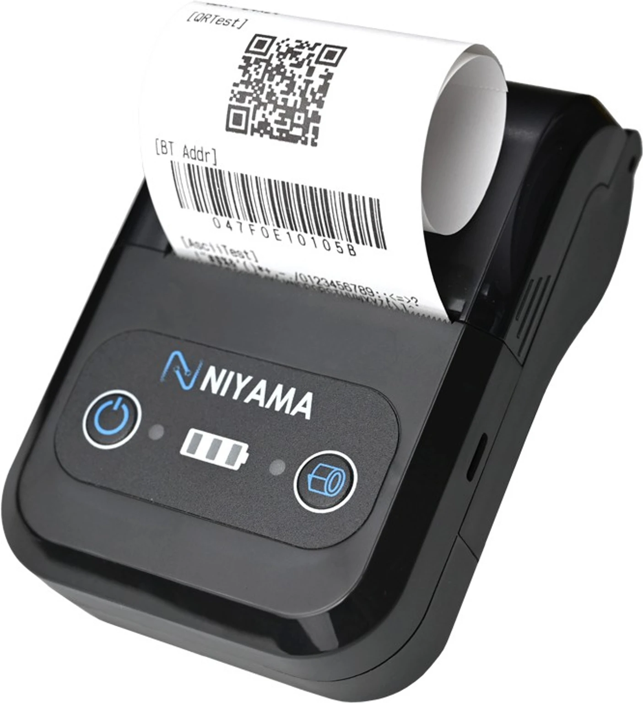

# Documentation for POS Niyama

This repository contains setup and support notes for POS Niyama.



## Overview

Use these instructions to install the printer driver, set up PHP, share the printer on Windows, and troubleshoot common printing issues.

## Driver Installation

`Niyama Printer Driver (1).exe` is the printer driver. Download it and install it on the PC connected to the printer.

## PHP Setup

1. Install PHP on the machine running the POS application.
2. Add PHP to your system `PATH`.
3. Verify the installation:

For PHP and Laravel browser-based printing, use:

- [mike42/escpos-php](https://github.com/mike42/escpos-php) - purpose: allows you to generate and print receipts with basic formatting, cutting, and barcodes on a compatible printer.
- [darkterminal/escpos-printer-server](https://github.com/darkterminal/escpos-printer-server) - purpose: EPS (ESC/POS Printer Server) executable bridges your web or desktop application and the thermal printer.

```powershell
php -v
```

## Printer Connection

1. Open Windows **Bluetooth & devices** settings.
2. Add the printer device from the Bluetooth/device settings path.
3. Connect the USB printer to the PC if required.
4. Install `Niyama Printer Driver (1).exe`.
5. Confirm the printer appears in Windows.

## Printer Sharing Setup

### Goal

Make the POS58 thermal printer available to the ESC/POS local print agent by sharing it from Windows and using the shared printer path in the app.

### Why This Is Needed

- The ESC/POS agent expects a printer path it can reach through Windows sharing.
- A plain local USB printer name may not work reliably.
- Sharing the printer creates a network path the agent can print to.

### Windows Setup Steps

1. Open **Printer properties** for `POS58 Printer`.
2. Go to the **Sharing** tab.
3. Enable **Share this printer**.
4. Set the share name to `POS58`.
5. Apply and save the changes.

### Verify in PowerShell

Run:

```powershell
Get-Printer | Format-Table Name, ShareName, PortName
```

You should see:

- `Name = POS58 Printer`
- `ShareName = POS58`
- `PortName = ...`

The printer `Name` might be different on your PC, but if you followed the steps above, the `ShareName` should still be `POS58`.

## App Configuration

Use this printer value in the app:

```env
ESC_POS_PRINTER_NAME="smb://Ngonie/POS58"
```

## Expected Result

- The ESC/POS agent connects to the shared printer path.
- The Laravel app sends print jobs without browser popups.
- Receipts print through the shared Windows queue.

## Troubleshooting

1. If `ShareName` is empty, the printer is not shared yet.
2. If the printer does not appear in `Get-Printer`, reinstall the driver.
3. If the share name changes, update `ESC_POS_PRINTER_NAME` to match.
4. If printing fails, confirm the USB printer is connected to the PC and the shared printer is enabled.
